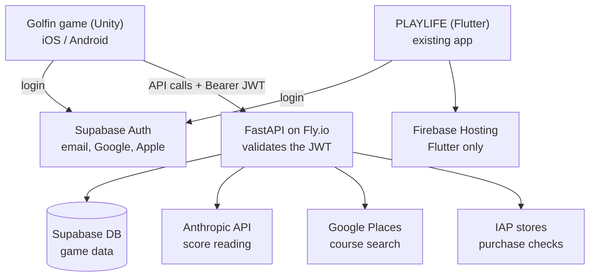
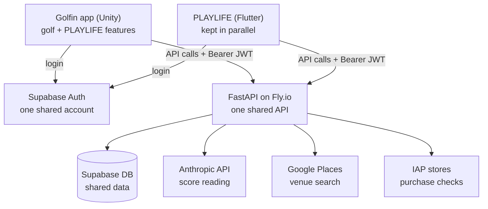
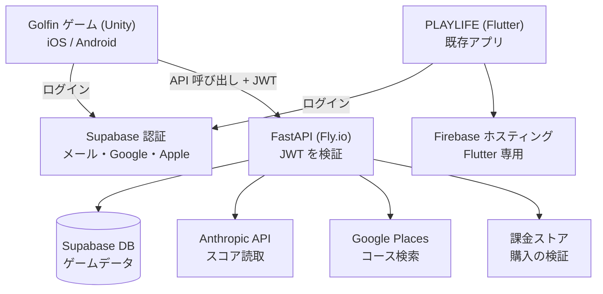
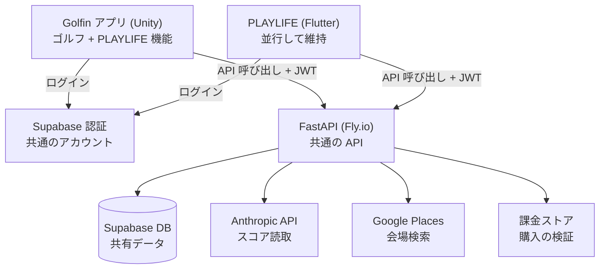

# Golfin × PLAYLIFE — Service Topology / サービス構成

Bilingual reference: which services exist, how they talk to each other, and which admin console governs
each one. Source of truth for the facts below: `Docs/GPS/GPS_INTEGRATION_REFERENCE.md`.

日英併記の資料です。どのサービスが存在し、どう連携し、どの管理コンソールが何を管理するかをまとめています。
記載内容の出典は `Docs/GPS/GPS_INTEGRATION_REFERENCE.md` です。

---

# English

## 1. Service inventory

| # | Service | What it owns here | Admin console |
|---|---|---|---|
| 1 | **Supabase** (`wmszyghwwkaptgqdunel`) | Authentication (login / JWT) **and** the entire Postgres database | supabase.com/dashboard |
| 2 | **Fly.io** (`playlife-api`, Tokyo) | The FastAPI backend and its secrets/env vars | fly.io/dashboard |
| 3 | **Google Cloud** | Google OAuth client **and** the Places API key (venue/course search) | console.cloud.google.com |
| 4 | **Apple Developer** | Sign in with Apple (Services ID + key) **and** the IAP shared secret | developer.apple.com |
| 5 | **Firebase** | Hosting for `playlife-app.web.app` (the Flutter app's OAuth redirect) + Flutter Analytics | console.firebase.google.com |
| 6 | **Google Play Console** | Android purchase verification (`com.wonderwall.playlife`) | play.google.com/console |
| 7 | **Anthropic** | The backend's API key for score image recognition | console.anthropic.com |
| 8 | **Backend source** (`playlife-main`) | The FastAPI code itself | Git repository |

## 2. Current topology (Golfin today)

**How to read it**

- The game talks to **two** services directly. Login goes straight to Supabase Auth — it never passes
  through our backend. Everything else goes to FastAPI, carrying the JWT that Supabase issued.
- **FastAPI is the chokepoint.** It is the only thing that touches the database or any external API.
  The game never reaches them directly.
- **Firebase is not in Golfin's path.** It hosts the redirect page the *Flutter* app uses after OAuth.
  The Unity game instead uses a custom deep link (`golfin://auth-callback`), so it bypasses that page.
- **Google Cloud and Apple Developer serve double duty:** they appear at the bottom as runtime APIs
  (Places, purchase verification) *and* they are where OAuth is configured — those settings live inside
  Supabase, not as a separate runtime hop.

## 3. Target topology (after PLAYLIFE is folded into the game)

The Unity app will contain both the golf game and the PLAYLIFE feature set. The existing Flutter app is
kept running in parallel.

**What changes**

1. **The backend stops being optional.** Today an API outage would cost Golfin only login; the golf game
   still runs. Once PLAYLIFE features are in, an outage also takes out check-ins, points, badges, social
   and tournaments. Fly.io + the backend source move from "nice for takeover" to roughly as critical as
   Supabase.
2. **Anthropic and Google Places become Golfin's concern.** Score recognition and venue search are
   PLAYLIFE features, so the game now depends on those keys and their billing.
3. **One account, one database, two apps.** The same user, points and badges appear in either app — that
   is the point of sharing the backend. The constraint: schema or API changes must keep *both* clients
   working; the Unity side cannot ship a breaking change alone.
4. **Firebase still isn't in Golfin's path** and drops further in priority.

## 4. Admin access — what to request and in what order

| Diagram element | Console | Priority |
|---|---|---|
| Supabase Auth + Supabase DB | Supabase | **Now** — blocks going live |
| FastAPI on Fly.io | Fly.io + backend source repo | **Required once PLAYLIFE is folded in** |
| Google Places (+ Google OAuth config) | Google Cloud | Phase B (Google sign-in) |
| IAP stores (+ Apple OAuth config) | Apple Developer / Play Console | Phase B (Apple sign-in) |
| Anthropic API | Anthropic account | Later |
| Firebase Hosting | Firebase | Low — Flutter only |

**Security note.** Becoming a Supabase Owner exposes the **`service_role`** key. It must never be put in
the game or shared. The only key the client may hold is the **`anon public`** key, which is public by
design (the Flutter app already ships it).

## 5. Known gaps (from the reference doc)

- **No API client in Unity yet.** The auth layer holds the session and JWT, but nothing attaches
  `Authorization: Bearer` to requests or refreshes on a 401. The Flutter app has a Dio interceptor for
  this; Unity has nothing. Roughly 20 API routers are coming, so this layer is the foundation.
- **The Flutter client has no 401 → refresh flow** either (noted as tech debt in the reference).
- **CORS is `*` and there is no app attestation** — the server cannot distinguish the real app from
  `curl` with a valid token. Identity is user-level, not app-level.
- **The GPS Trust subsystem** is called the product differentiator and is meant to be ported faithfully —
  likely the hardest part of the fold-in, more than the CRUD endpoints.

---

# 日本語

## 1. サービス一覧

| # | サービス | このプロジェクトでの役割 | 管理コンソール |
|---|---|---|---|
| 1 | **Supabase**（`wmszyghwwkaptgqdunel`） | 認証（ログイン / JWT）**および** Postgres データベース全体 | supabase.com/dashboard |
| 2 | **Fly.io**（`playlife-api`・東京） | FastAPI バックエンド本体と環境変数（シークレット） | fly.io/dashboard |
| 3 | **Google Cloud** | Google OAuth クライアント **および** Places API キー（会場・コース検索） | console.cloud.google.com |
| 4 | **Apple Developer** | Sign in with Apple（Services ID＋キー）**および** 課金の shared secret | developer.apple.com |
| 5 | **Firebase** | `playlife-app.web.app` のホスティング（Flutter アプリの OAuth リダイレクト先）＋ Flutter の Analytics | console.firebase.google.com |
| 6 | **Google Play Console** | Android の購入検証（`com.wonderwall.playlife`） | play.google.com/console |
| 7 | **Anthropic** | バックエンドがスコア画像認識に使う API キー | console.anthropic.com |
| 8 | **バックエンドのソース**（`playlife-main`） | FastAPI のコード本体 | Git リポジトリ |

## 2. 現在の構成（今の Golfin）

**図の読み方**

- ゲームは **二つ** のサービスと直接やり取りします。ログインは Supabase 認証に直接向かい、当社バックエンドを
  経由しません。それ以外はすべて、Supabase が発行した JWT を付けて FastAPI に向かいます。
- **FastAPI が要（かなめ）です。** データベースや外部 API に触れるのは FastAPI だけで、ゲームが直接
  触れることはありません。
- **Firebase は Golfin の経路にありません。** これは *Flutter* アプリが OAuth 後に使うリダイレクト用
  ページをホストしているものです。Unity のゲームは独自のディープリンク（`golfin://auth-callback`）を使う
  ため、このページを通りません。
- **Google Cloud と Apple Developer は二役です。** 図の下段では実行時の API（Places、購入検証）として
  登場しますが、同時に OAuth の設定場所でもあります。ただし OAuth の設定自体は Supabase の中に保存され、
  実行時に別途経由するわけではありません。

## 3. 統合後の構成（PLAYLIFE をゲームに取り込んだ後）

Unity アプリがゴルフゲームと PLAYLIFE の機能の両方を持つようになります。既存の Flutter アプリは
並行して維持します。

**何が変わるか**

1. **バックエンドが必須になります。** 現在は API が止まってもログインができなくなるだけで、ゴルフゲーム
   自体は動きます。PLAYLIFE の機能が入ると、チェックイン・ポイント・バッジ・ソーシャル・トーナメントまで
   止まります。Fly.io とバックエンドのソースコードの重要度が、Supabase とほぼ同等まで上がります。
2. **Anthropic と Google Places が Golfin 側の関心事になります。** スコア読取と会場検索は PLAYLIFE の
   機能なので、ゲームがこれらのキーと請求に依存するようになります。
3. **アカウント一つ、データベース一つ、アプリ二つ。** どちらのアプリで開いても同じユーザー・同じポイント・
   同じバッジになります（これが共通バックエンドの利点です）。制約として、スキーマや API の変更は **両方の**
   アプリが動き続けるようにする必要があり、Unity 側だけで破壊的変更を出すことはできません。
4. **Firebase は引き続き Golfin の経路になく**、優先度はさらに下がります。

## 4. 管理者権限 — 何を、どの順で依頼するか

| 図の中の要素 | 管理コンソール | 優先度 |
|---|---|---|
| Supabase 認証・Supabase DB | Supabase | **今すぐ** — 本番稼働のブロッカー |
| FastAPI (Fly.io) | Fly.io + バックエンドのソース | **PLAYLIFE 統合後は必須** |
| Google Places（+ Google OAuth 設定） | Google Cloud | フェーズ B（Google サインイン） |
| 課金ストア（+ Apple OAuth 設定） | Apple Developer / Play Console | フェーズ B（Apple サインイン） |
| Anthropic API | Anthropic アカウント | 後で |
| Firebase ホスティング | Firebase | 低（Flutter 専用） |

**セキュリティ上の注意。** Supabase の Owner になると **`service_role`** キーが見えるようになります。
これはゲームに入れたり共有したりしては絶対にいけません。クライアントが持ってよいのは **`anon public`**
キーだけで、これは公開前提のキーです（Flutter アプリでも既に配布されています）。

## 5. 既知の課題（リファレンス資料より）

- **Unity 側にまだ API クライアントがありません。** 認証層はセッションと JWT を保持していますが、リクエストに
  `Authorization: Bearer` を付ける仕組みや、401 で再取得する仕組みがありません。Flutter アプリには Dio の
  インターセプターがありますが、Unity にはまだ何もない状態です。今後およそ 20 の API ルーターを使うことに
  なるため、この層が土台になります。
- **Flutter クライアントにも 401 → リフレッシュの仕組みがありません**（リファレンスに技術的負債として記載）。
- **CORS が `*` で、アプリの真正性検証もありません。** 有効なトークンさえあれば、サーバーは本物のアプリと
  `curl` を区別できません。identity はユーザー単位であり、アプリ単位ではありません。
- **GPS Trust サブシステム** は製品の差別化要素とされ、忠実な移植が求められています。統合作業では、
  通常の CRUD エンドポイントよりもここが最も難しい部分になる見込みです。
