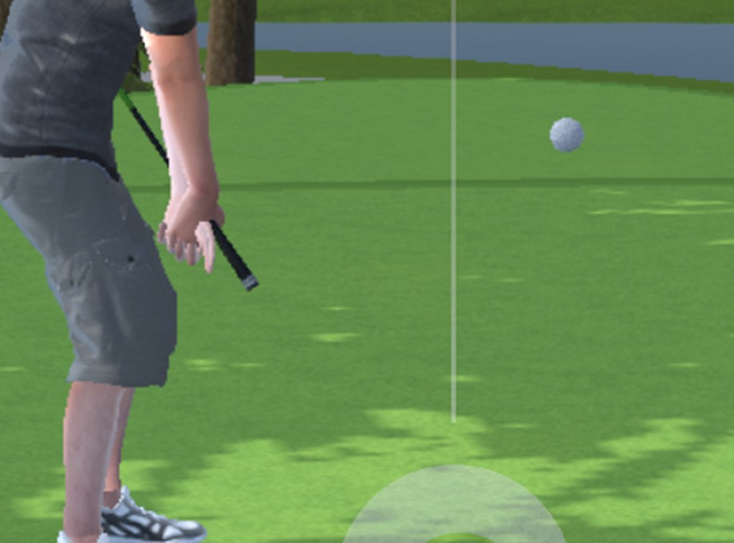
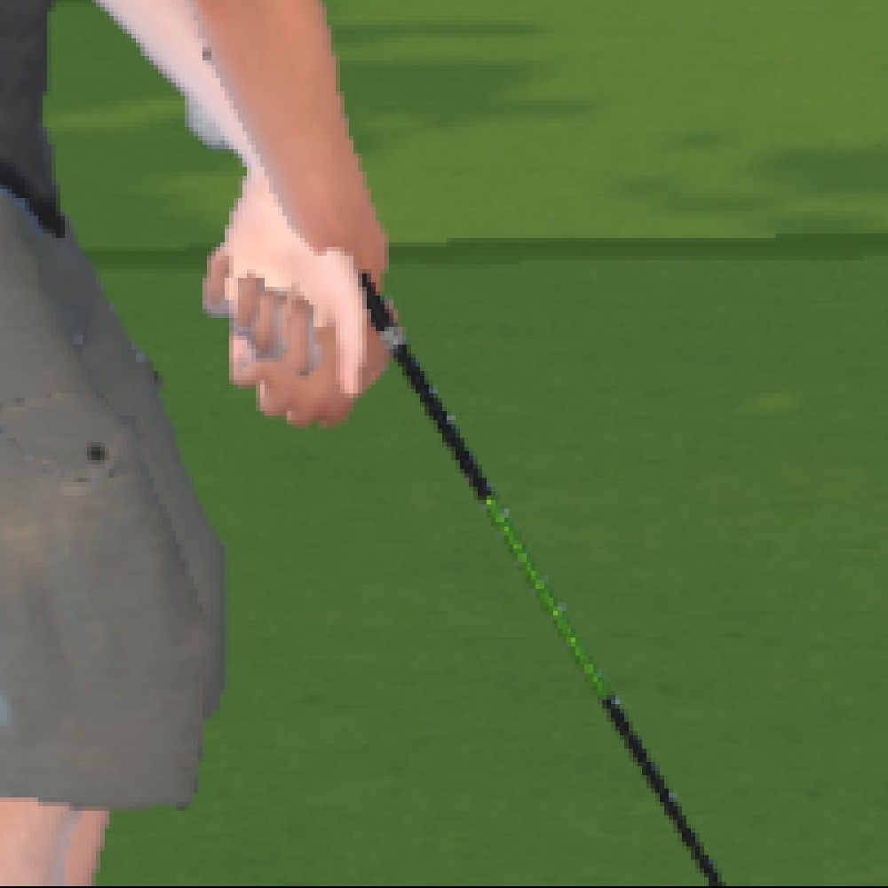
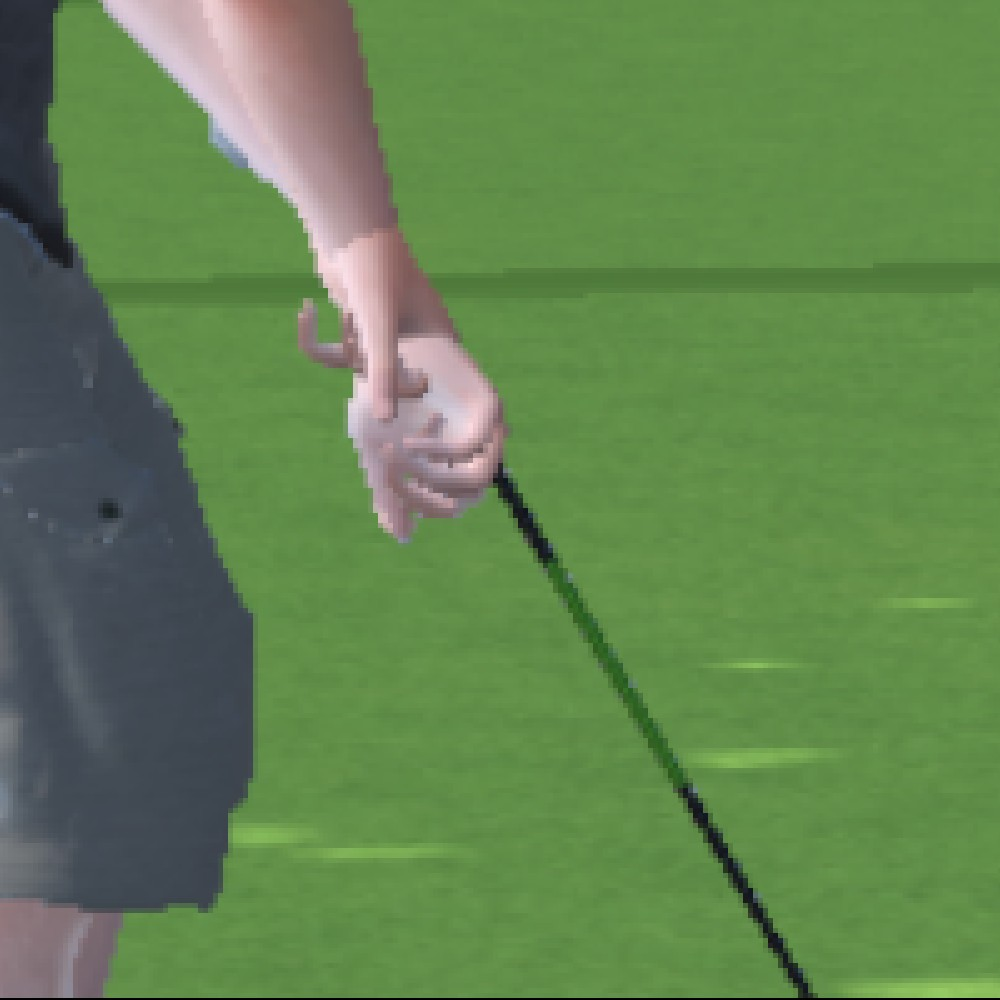
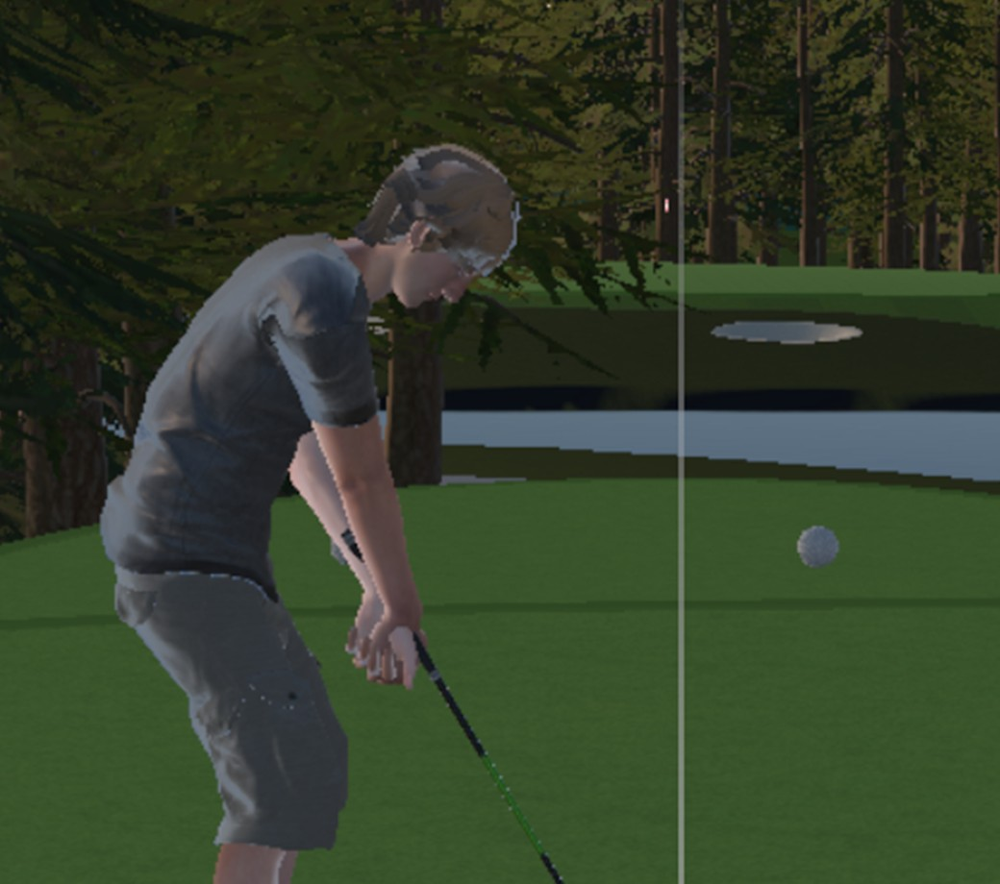
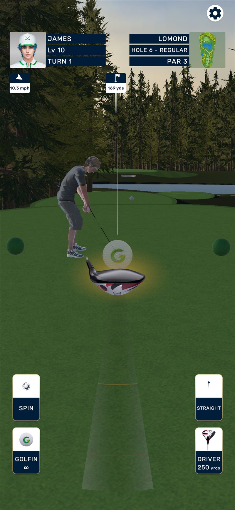

# golfer_club_grip — handoff to Architect: the rig runs, the grip does not

**From:** PC session (Claude Code), 2026-09-09
**Branch:** `golfer_3d_test` · nothing merged to `main`
**STATUS:** `READY_FOR_ARCHITECT_REVIEW`
**Prefab state as handed over:** exactly commit `376e97861` (verified byte-identical)

**Headline for the Architect:** your `ARCHITECT_DECISION_RIG_DEAD` fix was right and A0 is 0. But
once the rig actually ran, Cesar found **three more defects by eye that every §6 number scored
green**. The grip is still visibly wrong, and the reason it keeps passing is that §6 measures the
wrong things. That measurement gap is the decision I need from you — not another rig change.

---

## 1. What Cesar saw, in order, and what each one actually was

Every row: he called it in one glance from a frame; the assertions were green or near-green.

| # | Cesar's words | The measured cause | Status |
|---|---|---|---|
| 1 | *"the club is underground"* | rig never evaluated — `PropertyStreamHandle` threw **2,850×/run** | **fixed** (your decision) |
| 2 | *"the club is stabbing the player since it is backwards"* | `ClubEnd` marker sat on the **opposite end** from the mesh head | **fixed** |
| 3 | *"club a bit above them ... blade under the ground"* | club **0.148 m longer** than the golfer's reach | **fixed** |
| 4 | *"one hand inside the other"* | club pinned to the lead hand pushed the trail anchor **0.0301 m past the right arm** | **fixed** |
| 5 | *"hands wrongly rotated, going through one another"* | hand **orientation** is not constrained at all | **OPEN — §2** |

### 1.2 The backwards club, because it is the cleanest example of the gap

Measured off the driver mesh, in `ClubSlot` local space:

```
Grip      span -0.0411 .. +0.0878   -> butt cap at -0.0411
Shaft     span +0.3254 .. +0.7074
ClubHead  span +0.9633 .. +1.0815   -> head at +1.0224
```

So `ClubSlot` local **+Y runs BUTT → HEAD** — which is what `GolferPresenter` always said
(`axisD = slot.up; // club local +Y runs down the shaft to the head`) and what SPEC §3.2 says.

But the `ClubEnd` marker was at **−0.80** — the opposite end, **1.82 m** from the real head — and
the harness §3.4 solver carried the same inverted assumption. The solve dutifully planted that
marker on the ball, rotating the club 180°, and reported:

> `club.headAtBall — ClubEnd is 0.0198 m from the ball ... PASS`

A 2 cm PASS for a club buried in the golfer's chest. `GripAnchor_Lead` / `_Trail` were swapped too.


*Head up behind the shoulder, shaft through the chest, butt below the hand. `club.headAtBall` PASS.*

---

## 2. The open problem, and the decision I need

**Hand orientation is not constrained and is not measured.**

`IK_Lead` / `IK_Trail` are `TwoBoneIKConstraint`s with `targetRotationWeight = 0`. They set hand
**position** only; hand **rotation** still comes from the clip, authored for a club that is not
there. So the palms never turn to face the grip no matter how precisely the hands are positioned.

I tried the obvious thing and **it made it worse** — Cesar: *"way worst ... hands wrongly rotated,
going through one another."* Setting `targetRotationWeight = 1` forces **both** hands to the
anchors' rotation, and the anchors carry `ClubSlot`'s frame — a **club** orientation, not a **hand**
orientation. Both hands snapped to the same wrong rotation and interpenetrated. **Reverted.**

| current (handed over) | rejected experiment |
|---|---|
|  |  |
| `targetRotationWeight = 0` — hands correctly spaced on the shaft but flat, not wrapped | `targetRotationWeight = 1` — palms rotate to the club frame, hands interpenetrate |

**Every number is identical in both images.** `club.headAtBall` 0.0085, `grip.hands.order` 0.0695,
`grip.hand.onShaft_l/_r` 0.0000 / 0.0000, `grip.ikNoLegEffect` PASS, A0 = 0.

### Decision needed (I am not guessing a sixth time)

1. **What orientation should each anchor carry?** Making rotation work needs a per-hand rotation
   authored on `GripAnchor_Lead` / `GripAnchor_Trail` (lead and trail palms differ — they oppose
   each other on the grip). That is a value someone reads off the Inspector once, or a rule
   ("palm normal points at the shaft axis, thumb down the shaft") I can implement. Mixamo hand-bone
   local axes are not something I should infer.
2. **Is a flat, unwrapped hand acceptable for this experiment?** This rig has **no finger bones** —
   the eight `grip.*` finger assertions all SKIP. So the fingers can never close. If the answer is
   "orientation only, fingers stay open", §6 should say so.
3. **§6 needs a hand-orientation row.** Without one, the next iteration regresses this and not a
   single number moves. Suggested: angle between the hand's palm normal and the shaft axis at
   address, plus a hand-interpenetration check (distance between the two hand bone origins vs a
   measured hand width).

---

## 3. The second measurement gap, same shape

**`grip.hand.onShaft` measures the hand BONE ORIGIN — the wrist.** So `0.0000 m` is scored by
putting the shaft **through the wrist**, which leaves the palm beside the club. That is a large part
of why image 4 looks wrong while reading a perfect zero.

It should target the palm — i.e. carry a palm-radius offset, or measure from a palm point rather
than the bone origin. **I did not change it**, because moving it changes what §6 means and what the
0.035 m threshold is relative to. Your call.

---

## 4. What is genuinely fixed, with numbers

All from the final run, A0 = 0, **26 PASS / 2 FAIL / 8 SKIP**:

| assertion | dead rig | now |
|---|---|---|
| `club.headAtBall` | 0.7382 m (= the stance distance, not a club measurement) | **0.0085 m PASS** |
| `grip.hand.onShaft_l` | 1.0855 m | **0.0000 m PASS** (see §3) |
| `grip.hand.onShaft_r` | 1.1078 m | **0.0000 m PASS** (see §3) |
| `grip.hands.order` | 0.0188 m | **0.0695 m PASS** — the full anchor spacing, both hands on their anchors |
| `grip.ikNoLegEffect` | — | L 0.0527 / R 0.0933 **PASS**, inside the §9.8 band |
| §3.4 desired-vs-actual | 130.0170° | **0.2602°** |
| A0 rigging exceptions | 2,850 | **0** |

**How each was fixed — every value measured or searched, none tuned:**

1. Markers re-derived from the mesh bounds; the two `GripAnchor_*` were also swapped.
2. Solver axis flipped (`up = ball − hand`); `grip.hands.order` sign flipped with it; the
   hard-coded `0.91` lead-anchor-to-head replaced by a value read from the markers.
3. **Club scaled 0.86880.** A 1.328 m character was holding a full-size driver: lead-anchor-to-head
   1.0335 m against a 0.8855 m hand-to-ball, so the head buried 0.148 m at *any* rotation.
   Scale came from the harness's own new `§3.4 LENGTH` line. **This is worth your attention as a
   roster-pipeline question:** if characters are scaled to 1.328 m, club meshes need scaling too.
4. Club now hangs from the **hand midpoint** (what §1/§3.3 always asked — `GripTarget` *is* the
   0.5/0.5 MPC midpoint), then slid 0.010 m along the shaft by a **bounded** search maximising the
   worse of the two arms' reach slack, bounded so `club.headAtBall` stays inside budget.

New harness marks, all worth keeping: `§3.4 REACH` (measures shoulder→target against actual arm
length — I had twice *asserted* "out of reach" from a shortfall without proving it), `§3.4 LENGTH`,
`§3.4 BALANCE`, and `GolferTestVerificationRunner.SolverVersion`.


*Stage 2: axis corrected, club still too long — blade 0.13 m underground.*


*Full frame at address, current state: stance, club plane and head-at-ball are all correct.*

---

## 5. Corrections to my own earlier claims

- **"IK_Trail cannot reach — this is §3.4's stop condition, so I stopped."** Wrong twice over. It
  *was* out of reach, but only because I had pinned the club to the lead hand; rebalancing fixed it.
  I asserted the reach conclusion twice before ever measuring it. `§3.4 REACH` now measures it.
- **"`forceGripPose` was the cause of the hand stations."** No. It was serialized `1` against SPEC
  §3.5, I set it `false` — and **every grip number came back byte-identical**. The legacy
  `LateUpdate` grip was never doing the work; `IK_Lead` was. Left `false` because §3.5 mandates it,
  not because it changed anything.
- **"The rig needed building through the Animation Rigging editor UI."** Wrong; you were right —
  there is no editor-side registration, the layout was simply outside the stream root.
- **"targetRotationWeight = 1 fixed the wrap."** I told Cesar this was an improvement. It was not;
  he corrected me and I reverted it. Recorded here because it is in the commit history.

## 6. Not a game bug — a harness artefact Cesar spotted

*"The whole model disappears before taking the shot and re-enters, lighting seems to reset too."*
That is this harness: section 7 calls `QualityTierService.SetOverride(Low)` → `(High)` → `Auto`
immediately before the shot, and Low sets `animatorCulling = CullCompletely`. Nothing in the real
shot path does that. Worth restoring the tier *after* the shot block instead, so the measured shot
is not taken across a quality flip.

## 7. Repo / environment state

- Branch `golfer_3d_test`, prefab byte-identical to `376e97861`. `main` untouched.
- Diff outside `Docs/` is the gated `_Test` prefab and the Editor-only harness. No shipped runtime
  code changed; no `manifest.json` change.
- Active build profile restored to **`iOS-Full-GPS`**. Animation Rigging **1.3.1** (Registry, not
  preview). EditMode 2762/2765; §9.6 build gate 5/5 with the define off.
- **Two traps that cost most of this session, both now in memory:** Unity only auto-imports on
  Editor *focus*, so over MCP `.cs` edits sit unimported and runs execute the **previous** build
  while "0 compile errors" reads clean; and saving this prefab while `GOLFIN_GOLFER_TEST` is **off**
  silently strips every `#if`-gated `GolferPresenter` field (it happened, and was restored from the
  commit).
