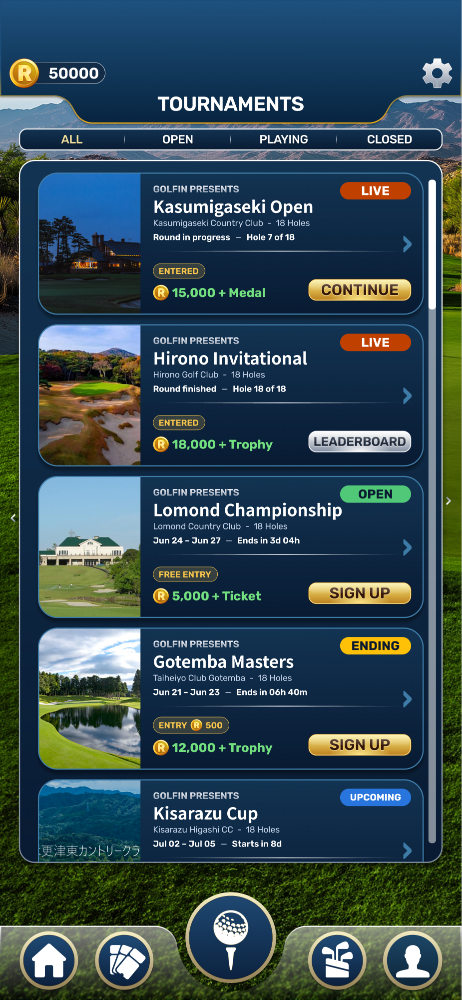

# Tournament Selection Screen (T7) — Code-Proof Spec  ⟳ REVISED (redo after rebuild-from-scratch failure)

> **⚠ This is the REDO.** The first pass violated clone-and-modify — it rebuilt the screen scaffold + buttons from scratch (no panel, hand-rolled CTA, no course images). Full record: `ARCHITECT_HANDOFF.md`. This revision (a) pins **every** reuse source to a concrete file/object handle, (b) re-sequences **card-first** (Cesar), (c) adds the missing **gold-button extraction** + **course-image export**, (d) **salvages** the sound card C# + nav edits.
> **Figma:** `13386:1758` "Tournament Selection v7" · canvas 1170×2532 · title "TOURNAMENTS". **Authority:** §3 tokens + node links = truth; `reference/tournament_selection_screen.png` = guide.

---

## 0. HARD rules
1. **Clone-and-modify, never rebuild.** Every chassis element (panel/bg, scroll, the 4 filter tabs, both CTA buttons, RP icon) is a **duplicate/instance of a named existing asset** (§1). The **only** net-new prefab is `TournamentSelectionCard`.
2. **Clone-provenance gate (PIPELINE_HARDENING).** For **every** row in §1 the implementer report MUST cite the prefab GUID / scene-object it cloned from (e.g. "CTA = instance of `GoldPrimaryButton.prefab` guid …"; "chassis = duplicate of `RankingsScreen.prefab`"). **A reuse row with no provenance = auto-FAIL.** This is what the three gates missed on iter-1.
3. **Salvage, don't restart** (§5): Code's card C# + nav edits are correct — reuse them.
4. Tokens §3 literal; TMP size = Figma px ÷ 1.4; CanvasScaler 1170×2532 Match 0.

---

## 1. Concrete reuse handles (verified on disk 2026-06-25)
| Element | CLONE FROM — concrete handle | Action |
|---|---|---|
| **Screen chassis** (back panel/bg + scroll list + tab bar) | **`Assets/Prefabs/UI/Rankings/RankingsScreen.prefab`** — has the Daily/Weekly/Monthly/History tab row + ranking scroll + dark back panel. *(Fallback if it doesn't fit: duplicate the in-scene `TournamentHoleSelection` subtree hosting `TournamentHoleSelectionScreenController` in `ShellScene.unity` — the Cesar-approved tournament chassis.)* | duplicate → rename `TournamentSelectionScreen` |
| **4 filter tabs** ALL/OPEN/PLAYING/CLOSED | the tab row in RankingsScreen (`RankingsScreenController._dailyTab/_weeklyTab/_monthlyTab/_historyTab`) | relabel the 4 buttons; keep active-underline |
| **Gold CTA** (SIGN UP / CONTINUE) | **extract `Assets/Prefabs/UI/Common/GoldPrimaryButton.prefab` from `PlayButton`** in `ShellScene.unity` (m_Name `PlayButton`, fileID `4123466008247632389`) — **Stage 0a** | create shared prefab, then instance it in the card |
| **Silver CTA** (LEADERBOARD) | **`Assets/Prefabs/UI/Tournaments/TournamentCloseButton.prefab`** (exists; was used 0× in the failed pass) | instance it |
| **RP reward icon** | **`Assets/Art/HomeScreen/Reward Points Icon.png`** | sprite on the card reward row |
| **Course images** (6) | **ALREADY EXPORTED on disk → `Assets/Art/Tournaments/CourseImages/`** (lomond/gotemba/hirono/kasumigaseki/kisarazu `.png` + kawana `.jpg`) — per-card mapping in **§8** | **Stage 0b = import + assign per card** (Sprite 2D, full-rect); no Figma export needed |
| Persistent bars | `PersistentUIManager` (keep Code's edit) | banner "TOURNAMENTS" |
| Card state/badge/bind logic | **salvage `TournamentSelectionCard.cs`** (Code's — correct, chassis-agnostic) | re-attach to the rebuilt card prefab |
| **NEW** | `Assets/Prefabs/UI/Tournaments/TournamentSelectionCard.prefab` | only net-new prefab |

---

## 2. Screen structure (nodes under `13386:1758`)
Top UI `13386:1760` (banner "TOURNAMENTS") → persistent bars. Filter Strip `13386:1761` → tabs `ALL` `13386:1763` / `OPEN` `13386:1767` / `PLAYING` `13386:1771` / `CLOSED` `13386:1775` (dividers `…1766/1770/1774`). Content `13386:1778` → Cards Container `13386:1779` (card pitch 384 = 360 + 24 gap). Nav Bar `13386:1852`; Scrollbar `13386:1853`.
**Cards (978×360):** Kasumigaseki `13389:1884` (LIVE/ENTERED→CONTINUE) · Hirono `13405:1858` (LIVE/finished→LEADERBOARD silver) · Lomond `13386:1780` (OPEN→SIGN UP) · Gotemba `13386:1804` (ENDING, ENTRY ⓡ500→SIGN UP) · Kisarazu `13386:1828` (UPCOMING) · Kawana `13389:1849` (ENDED).
**Card anatomy** (canonical Lomond `13386:1780`): `tournament_image` 260×360 left bleed `13386:1781` · chevron `›` `13386:1782` · state badge pill · Content (col, gap24, pad28/32): GOLFIN PRESENTS eyebrow + name + club·holes; Hours+Map row; separator; Action Row = Entry+Rewards (badge + RP icon + amount) | CTA button.

---

## 3. Tokens (literal — Lomond OPEN `13386:1780`, get_design_context 2026-06-25)
**Card container:** bg linear-gradient ↓ `#133453`→`#091b33`; border **3px** `#3e7ca8`; radius **50**; shadow `0 10 10 rgba(0,0,0,0.4)`; 978×360.
**tournament_image:** 260×360 object-cover left.
**Chevron `›`:** Rubik Bold **80** (~57 TMP) `#3e7ca8`, right 53.
**State badge (OPEN):** pill 180×44, r22, top21/right29; fill **`#50c878`** (Rare token); "OPEN" Rubik Bold **32** (~23) `#0a1a30`.
**Content:** col, gap **24**, pad **28 / 32**.
**GOLFIN PRESENTS:** Rubik SemiBold **24** (~17), gradient white→`#d1d6e0`→`#828fa1`.
**Name:** **Noto Sans JP Bold 42** (~30 TMP) white.
**Club+holes:** Rubik Regular **22** (~16) `#c7d6eb`.
**Hours+Map** (gap12, 22): date/countdown Rubik SemiBold white; dash `—` Rubik Regular `#c7d6eb`.
**Separator:** 1px hairline image.
**FREE ENTRY badge:** fill `rgba(250,199,77,0.18)`, border 1px `#fac74d`, pad 6/14-16, r22; "FREE ENTRY" Rubik SemiBold **22** (~16) `#fac74d`. *(ENTRY-fee variant: `ENTRY` + RP icon 30 + amount.)*
**RP amount:** RP icon **40×40** + Rubik Bold **32** (~23) `#73e080`.
**Gold CTA (SIGN UP):** 260×54, r20, outer border 1px `#422100`; inner border 2px `#ffe48b`, gradient ↓ `#fcf195`→`#d6ab42`(60%)→`#bb7f1d`; label Rubik SemiBold **39** (~28) `#321506`, tracking -0.24, lh54, white-30% shadow. **= the extracted `GoldPrimaryButton.prefab`.**
**Per-state badge fills** (extract per node in Stage 0c; geometry constant 180×44/r22): LIVE red (`13389:1887`/`13405:1861`) · OPEN `#50c878` ✓ · ENDING amber (`13386:1807`) · UPCOMING blue (`13386:1831`) · ENDED grey (`13389:1852`).

---

## 4. State matrix (badge + entry + CTA, per `TournamentState`+`EntryState`)
- **OPEN** not entered → green badge, entry badge (FREE/fee), **SIGN UP** (gold).
- **ENDING** not entered → amber badge, **SIGN UP** (gold).
- **Playing/ENTERED** in progress → LIVE badge, **CONTINUE** (gold) → resume T8b.
- **Playing/ENTERED** finished → LIVE badge, **LEADERBOARD** (silver) → T9.
- **UPCOMING** → blue badge, "Starts in …", CTA = flag (disabled/"Notify").
- **ENDED/CLOSED** → grey badge, CTA = flag (LEADERBOARD or disabled).
Countdown/status computed from `(startUtc, endUtc, entry, ITournamentClock.UtcNow)` — Stage 2.

---

## 5. Salvage / discard (explicit)
**SALVAGE (keep, re-use):**
- `TournamentSelectionCard.cs` — state matrix, `ApplyBadge`, `BindStatic`, free/paid toggle, CTA-text logic. Chassis-agnostic and correct; re-attach to the rebuilt card prefab.
- `ScreenManager` `ScreenId.TournamentSelection`, `PersistentUIManager` banner + showBars, `TournamentDevEntryButton` route, `TournamentHoleSelectionScreenController` back-target → ScreenId.TournamentSelection. **All correct — keep.**

**DISCARD / REDO:**
- The bespoke `TournamentSelectionScreenController` bare-scroll scaffold → rebuild on the cloned chassis (panel/bg/scroll/tabs from RankingsScreen.prefab).
- The hand-rolled CTA + bespoke shapes in `TournamentSelectionCard.prefab` → instance `GoldPrimaryButton.prefab` + `TournamentCloseButton.prefab`; real RP icon + course image sprites.

---

## 6. Staging — CARD-FIRST (per Cesar)
- **Stage 0a — extract `GoldPrimaryButton.prefab`** from `PlayButton` (ShellScene). Self-contained shared button prefab (gold gradient, sheen, label). Cite source GUID.
- **Stage 0b — import the 6 course images** (Architect already exported them → `Assets/Art/Tournaments/CourseImages/`; per-card mapping §8): set each to **Sprite (2D, full-rect)**, assign per card. Note `kawana.jpg` is full-res and `kisarazu.png` is 260×212 → both **cover-fit** the 260×360 slot. No Figma export step.
- **Stage 0c — `TournamentSelectionCard.prefab`** ← THE focus. Real prefab: **nested instances** of `GoldPrimaryButton.prefab` (SIGN UP/CONTINUE) + `TournamentCloseButton.prefab` (LEADERBOARD), RP-icon sprite, course-image sprite, badge pill, separator; §3 tokens; per-state visuals; salvaged `TournamentSelectionCard.cs` attached. Get the card pixel-right **standalone** (render it in isolation). **Cesar visual gate on the CARD.**
- **Stage 1 — screen:** duplicate `RankingsScreen.prefab` → rename `TournamentSelectionScreen` → relabel 4 tabs ALL/OPEN/PLAYING/CLOSED → swap ranking-card list for `TournamentSelectionCard` instances (one per state, static) → persistent bars "TOURNAMENTS" → nav (card→T8b carry id; LEADERBOARD→T9) → replace ModeSelection TEMP entry (keep Code's edits). **Cesar visual gate on the SCREEN.**
- **Stage 2 — bind `ITournamentBackend.GetTournaments()`** (state-driven badge/entry/CTA, filter logic, countdowns, Register flow). **Blocked on T1→T4.**
- **Stage 3 — expand-in-place (U1) + sign-up/character-lock modal** (`ModalController`).

---

## 7. Flags / decisions
- **Chassis pick:** RankingsScreen.prefab (recommended, tabbed prefab) vs in-scene TournamentHoleSelection subtree (approved, pills). Implementer confirms which carries panel+scroll+tabs cleanly and **cites provenance**; flag back if neither fits before hand-rolling.
- **Course-image ids/crops:** the Figma fills are real photos; confirm acceptable at 260×360 object-cover.
- **UPCOMING / ENDED CTA** — disabled / "Notify" / LEADERBOARD?
- **Tab label `PLAYING`** (Figma) vs GDD `Active` → Figma canonical; reconcile GDD.
- **Name font** Noto Sans JP Bold for EN names — confirm or swap Rubik for EN.

---

## 8. References & direct Figma links
**File key:** `5gEAHjl6xAtW8iYY7NMvWd` · link form `https://www.figma.com/design/5gEAHjl6xAtW8iYY7NMvWd/?node-id=<ID>` (ID uses a **dash**, e.g. `13386-1758`).

**Screen + structure (click to open the exact node):**
- Screen root — [13386:1758](https://www.figma.com/design/5gEAHjl6xAtW8iYY7NMvWd/?node-id=13386-1758)
- Filter strip (4 tabs) — [13386:1761](https://www.figma.com/design/5gEAHjl6xAtW8iYY7NMvWd/?node-id=13386-1761)
- Cards Container — [13386:1779](https://www.figma.com/design/5gEAHjl6xAtW8iYY7NMvWd/?node-id=13386-1779)
- **Canonical card** (Lomond OPEN, all §3 tokens) — [13386:1780](https://www.figma.com/design/5gEAHjl6xAtW8iYY7NMvWd/?node-id=13386-1780)
- Gold CTA component instance (“Sign Up Button”) — [13386:1803](https://www.figma.com/design/5gEAHjl6xAtW8iYY7NMvWd/?node-id=13386-1803)

**Per-card links + course-image mapping** (image already on disk under `Assets/Art/Tournaments/CourseImages/`):
| Card | State | Card node (link) | `tournament_image` node | On-disk file | Px |
|---|---|---|---|---|---|
| Kasumigaseki Invitational | LIVE / ENTERED→CONTINUE | [13389:1884](https://www.figma.com/design/5gEAHjl6xAtW8iYY7NMvWd/?node-id=13389-1884) | `13389:1885` | `kasumigaseki.png` | 260×360 |
| Hirono Championship | LIVE / finished→LEADERBOARD | [13405:1858](https://www.figma.com/design/5gEAHjl6xAtW8iYY7NMvWd/?node-id=13405-1858) | `13405:1859` | `hirono.png` | 260×360 |
| Lomond Open | OPEN→SIGN UP | [13386:1780](https://www.figma.com/design/5gEAHjl6xAtW8iYY7NMvWd/?node-id=13386-1780) | `13386:1781` | `lomond.png` | 260×360 |
| Gotemba Masters | ENDING / ENTRY ⓡ500→SIGN UP | [13386:1804](https://www.figma.com/design/5gEAHjl6xAtW8iYY7NMvWd/?node-id=13386-1804) | `13386:1805` | `gotemba.png` | 260×360 |
| Kisarazu Cup | UPCOMING | [13386:1828](https://www.figma.com/design/5gEAHjl6xAtW8iYY7NMvWd/?node-id=13386-1828) | `13386:1829` | `kisarazu.png` | 260×212 → cover-fit |
| Kawana Fuji Open | ENDED | [13389:1849](https://www.figma.com/design/5gEAHjl6xAtW8iYY7NMvWd/?node-id=13389-1849) | `13389:1850` | `kawana.jpg` | 980×517 → cover-fit |

**Reference images** (guide only — metrics §3 + node links win on any conflict):
- Full screen render: `reference/tournament_selection_screen.png`
- 6 course photos: `Assets/Art/Tournaments/CourseImages/{lomond,gotemba,hirono,kasumigaseki,kisarazu}.png`, `kawana.jpg`

**Per-state badge fill nodes** (geometry constant 180×44 r22; pull fill per node in Stage 0c):
LIVE red `13389:1887` / `13405:1861` · OPEN green `13386:1783` · ENDING amber `13386:1807` · UPCOMING blue `13386:1831` · ENDED grey `13389:1852`.
