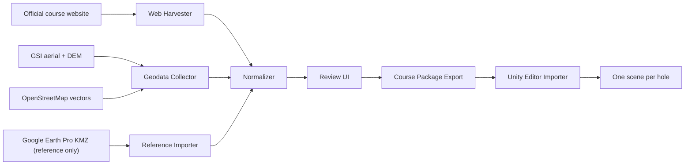

# Architecture

## Product

The first product should be a desktop application named `Course Intake`.

Its job is to centralize all data needed to recreate a golf course in Unity and export a normalized package that downstream tools can trust.

## Why Start Here

The hardest part is not Unity scene generation. It is building a trustworthy, reviewable, legally safe course dataset from mixed online sources. Once the data package is stable, Unity import becomes deterministic.

## System Overview

## Modules

### 1. Source Registry

Tracks every source used by the course package:

- URL or file path
- Source type
- License summary
- Attribution text
- Timestamp fetched
- Trust level
- Review status

This registry prevents silent mixing of authoritative and non-authoritative data.

### 2. Web Harvester

Responsibilities:

- Scrape official course pages
- Download hole detail images and gallery images
- Parse scorecards, pars, and tee yardages
- Extract textual hole descriptions when available
- Record all raw artifacts

Recommended stack:

- `Playwright` for scripted collection
- HTML parser for extraction
- Optional OCR for scorecards embedded as images

### 3. Geodata Collector

Responsibilities:

- Pull aerial imagery for the course extent
- Pull DEM or elevation raster
- Pull vector context layers such as roads, water, structures, and tree areas
- Reproject everything into one working coordinate reference system

Recommended stack:

- `Python`
- `GDAL`
- `rasterio`
- `geopandas`
- `shapely`

Storage:

- `SpatiaLite` for a simpler desktop-first build
- `PostGIS` if multi-user workflows arrive later

### 4. Georeferencer

Responsibilities:

- Align official hole map images to real-world coordinates
- Save control points and residual error
- Produce world-space extents for each hole

This is the hinge between scraped course art and actual gameplay geometry.

### 5. Hole Delineation Engine

Responsibilities:

- Generate candidate polygons and splines for each hole
- Mark tee complexes, fairway corridor, green, bunkers, water, rough, trees, and cart paths
- Estimate a centerline from primary tee to primary green

Automation level:

- High confidence for coarse segmentation
- Medium confidence for fine golf-specific boundaries
- Always human review before export

Suggested AI components:

- General segmentation model such as SAM2
- Traditional CV post-processing for masks and edges
- Rule-based cleanup tuned for golf layouts

### 6. Review UI

Responsibilities:

- Show each hole with synchronized overlays
- Compare official map, aerial imagery, DEM hillshade, and extracted shapes
- Let the operator edit points, polygons, classifications, and hole bounds
- Resolve source conflicts with explicit approvals

This is the minimum human-in-the-loop layer needed to keep the pipeline practical.

### 7. Exporter

Outputs a normalized package:

- `course.json`
- `provenance.json`
- One `hole.json` per hole
- Optional GeoJSON and raster artifacts per hole

The exporter should never emit a package if required provenance or attribution fields are missing.

## Source Trust Model

Assign a trust grade to each source:

- `official`: club website, club PDFs, operator-supplied survey files
- `public_authoritative`: GSI data
- `public_community`: OpenStreetMap
- `reference_only`: Google Earth Pro screenshots, KMZ, operator notes
- `derived`: AI segmentation, inferred hole extents, inferred centerlines

The app should surface conflicts such as:

- Official yardage total mismatch
- Hole count mismatch
- Georeferencing drift
- Shape confidence too low

## Coordinate System Strategy

Store every hole in:

- WGS84 for interchange metadata
- A projected local metric CRS for geometry processing and Unity import

Recommended practice:

- Keep exported geometry in meters
- Include the CRS identifier in every geometry-bearing artifact
- Define one local origin per hole for Unity scene placement

## Suggested Tech Stack

### App Shell

- `Tauri + React + TypeScript`

Why:

- Good desktop ergonomics
- Easy UI iteration
- Can call Rust or Python workers
- Simple file-based export

### Workers

- `Python` for geospatial work
- `Playwright` for scraping

### Data

- JSON for package metadata
- GeoJSON for reviewed vector outputs
- GeoTIFF or PNG RAW for height/elevation intermediates

## Workflow

1. Create course record.
2. Ingest official site and scorecard data.
3. Pull licensable imagery/elevation/vector context.
4. Align official maps to world coordinates.
5. Auto-segment hole components.
6. Review and correct each hole.
7. Export normalized package.
8. Run Unity importer to generate one scene per hole.
